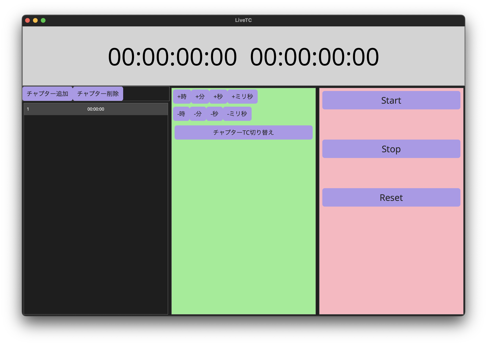

# LiveTC
Youtubeで同時視聴する際のタイムコード表示を補助するアプリです。  
左側が本編を通しで見るためのタイムコードで、右側がチャプター毎にカウントできるタイムコードになります。  
チャプターが無い場合は消す事ができます。

## 特徴
- タイムコードのスタートをカウントダウン方式にすることで再生タイミングが取りやすい
- チャプターと全体の同時カウント機能
- 上下ボタンによるTC微調整機能

## 使い方
### 右側（赤）
タイムコードを開始、停止、リセットできます。

### 中央（緑）
タイムコードの微調整を行うための項目です。時、分、秒、ミリ秒をそれぞれ加算、減算して開始タイミングを微調整できます。  
`チャプターTC切り替え`ボタンを押すことでチャプター用タイムコードの表示、非表示を切り替えられます。  

### 左側（黒）
チャプターのタイムコードを管理するリストです。追加と削除ができます。  
チャプター２が始まったらリストに追加して０から開始できます。